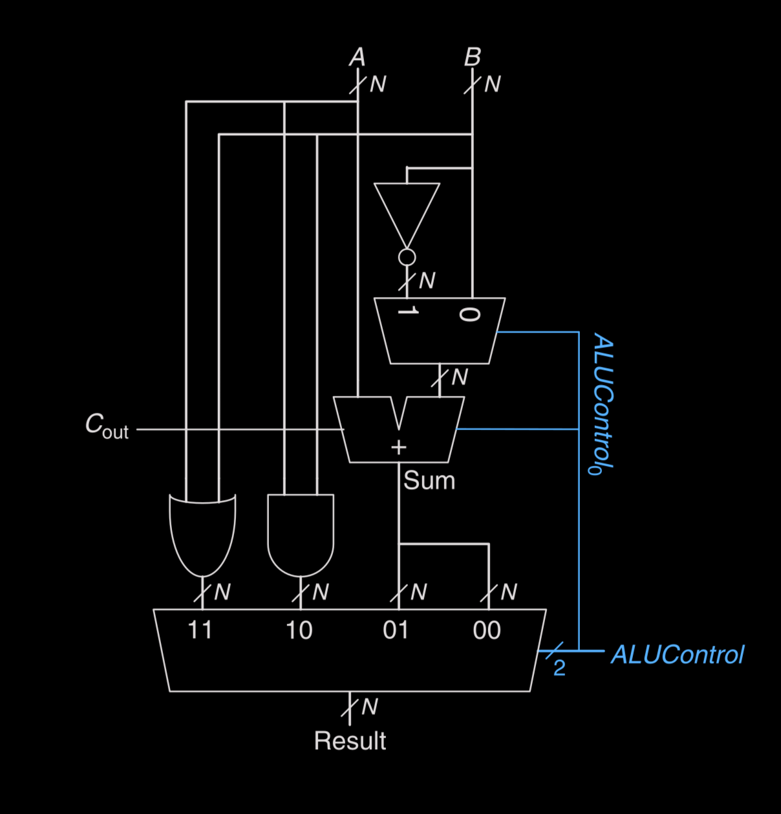
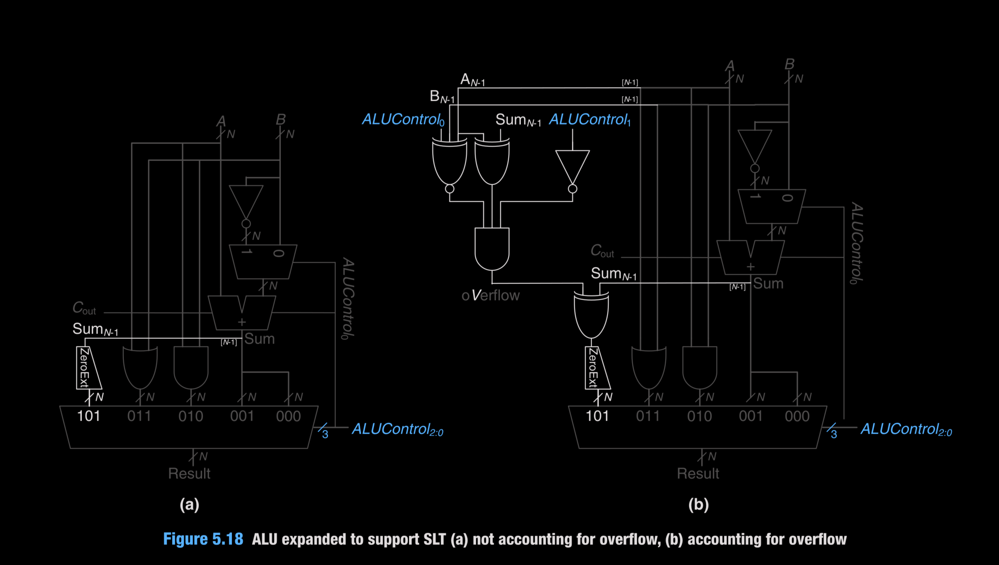
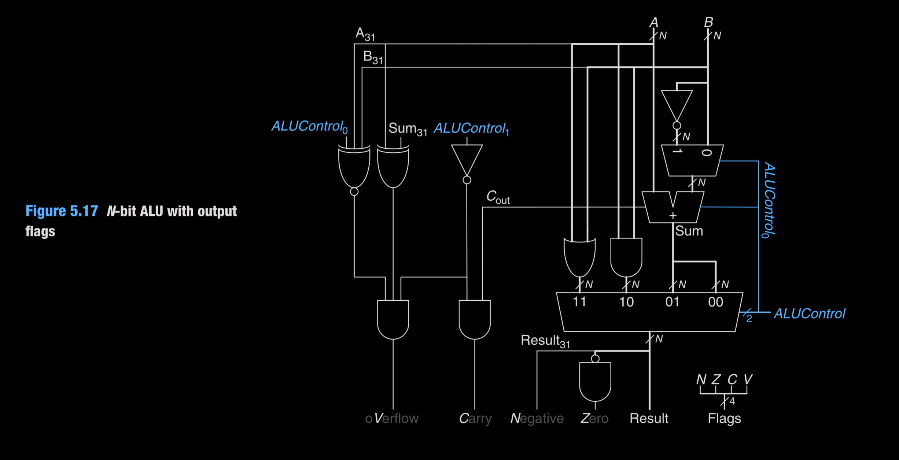

# ALU

Implements RV32I ALU ops used by the core: add, sub, and, or, slt, plus flags (Z, N, C, V). Control is a 3-bit `aluControl` from the ALU decoder.

*Basic ALU*: 2:1 mux on B lets the adder do add/sub; result mux selects add/sub/and/or using `ALUControl[2:0]`.

*ALU with SLT*: Adds the MSB-sign check to create SLT (`101`), either without overflow fix (left) or using overflow-aware sign (right).

*Final ALU with flags*: Carries Zero/Negative/Carry/Overflow flags; subtract uses invert-B plus carry-in, SLT uses the overflow-corrected sign bit.

## Module
- `alu.v`: two-operand ALU with internal invert-B for subtract; zero flag via reduction, carry from adder, overflow per signed add/sub. `aluControl` map:
  - `000` add / `001` sub
  - `010` and / `011` or
  - `101` slt (signed)

Flags: `Z`=result==0, `N`=MSB, `C`=adder carry on add, `V`=signed overflow on add/sub.
