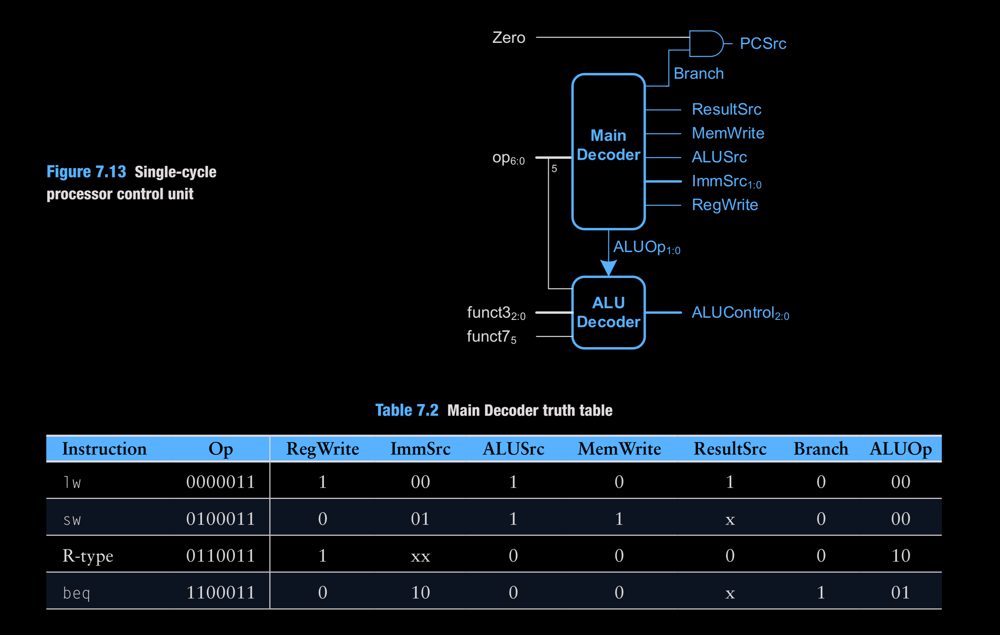
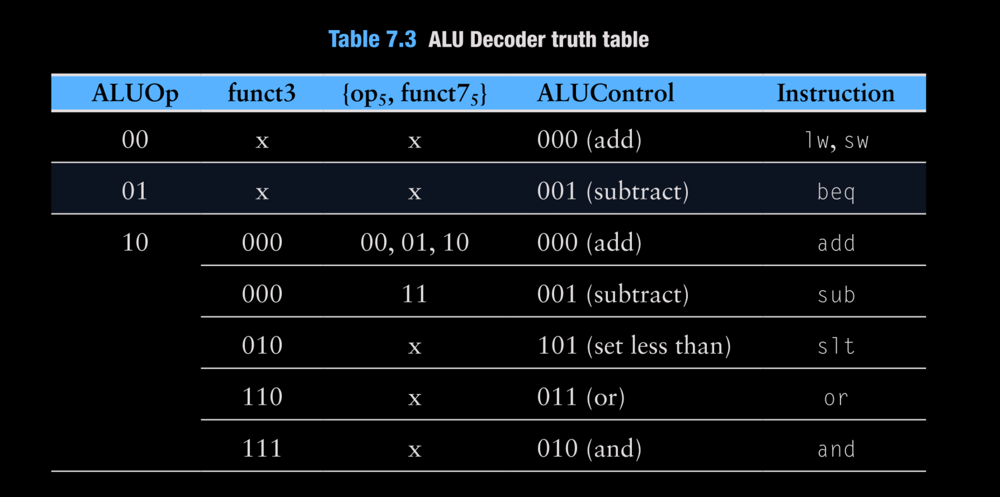

# Control Unit

Two-stage control: a main decoder that interprets the opcode, and an ALU decoder that refines ALUControl using funct3/funct7. PCSrc is Branch & Zero.

## Modules
- `main_decoder.v`: drives RegWrite, MemWrite, ResultSrc, ALUSrc, ImmSrc, Branch, ALUOp per opcode (see Table 7.2 mapping for lw, sw, R-type, beq).
- `alu_decoder.v`: maps ALUOp + funct3/funct7/op5 to `aluControl` (add/sub/and/or/slt).
- `control_unit_top.v`: wraps both decoders, exposes control signals, and computes `PCSrc = Branch & zero`.

Signals of interest: `ImmSrc` (I/S/B), `ResultSrc` (ALU vs memory), `ALUSrc` (reg vs imm), `ALUOp` (00 load/store, 01 branch/sub, 10 R-type).
