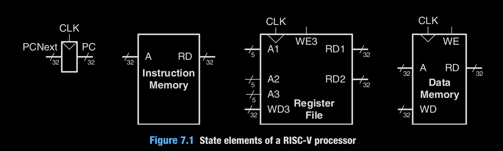
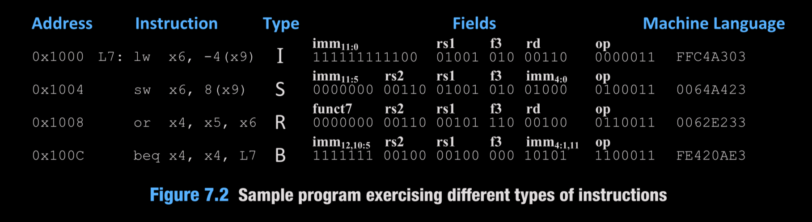

# Microarchitecture Blocks

State elements and datapath primitives used by the single-cycle core: PC update, memories, register file, muxes, adder, and sign-extend. The PC holds the current instruction address; PCNext selects the next address (PC+4 or branch target). Instruction and data memories read combinationally; all writes occur on the rising clock edge so state only changes at the clock.

## Modules
- `P_C.v`: program counter register, async active-low reset to 0, loads `PC_NEXT` on each rising edge.
- `PC_Adder.v`: 32-bit adder used for PC+4 and branch target.
- `instruction_memory.v`: 1K x 32 read-only array; combinational read at `RD = memory[A[31:2]]`, reset forces zeros.
- `data_memory.v`: 1K x 32 array; word-addressed via `A[31:2]`, combinational read, synchronous write when `WE` asserted.
- `register_file.v`: 32 x 32 regs, two read ports, one write port; x0 hard-wired to 0; async reset clears all; writes on posedge when `WE3` and `A3!=0`.
- `mux.v`: 2:1 mux for 32-bit buses (used for SrcB, PC mux, Result mux).
- `sign_extend.v`: extends immediates based on `ImmSrc` (I, S, B formats).

## Behavioral notes
- PC points to the current instruction; PCNext feeds PC on the next clock edge.
- Instruction/data memories and register file read combinationally; only writes are clocked (rising edge), matching the single-cycle model in Figure 7.1. Address, data, and write-enable must be stable around the clock edge.
- Branch target = `PC + ImmExt`; next PC selects between PC+4 and branch target using `PCSrc` from the control unit.
- The provided `sample_instructions.png` corresponds to the test program used in `imem.hex` (lw, sw, or, beq) and drives the observed waveform.
