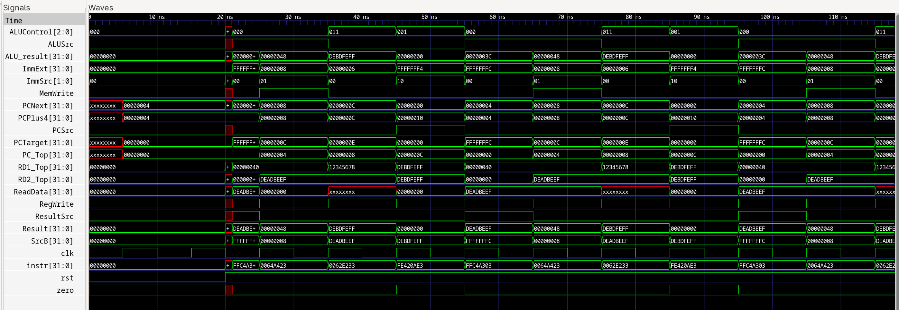

# RISC-V Single-Cycle Core

A minimal RV32I single-cycle datapath implementing the textbook subset (lw, sw, R-type add/sub/and/or/slt, beq). The design follows the classic PC → Instruction Memory → Register File → ALU/Data Memory loop with a control unit split into main and ALU decoders.


## Supported instructions
- `lw`, `sw` with word-aligned addresses
- R-type: `add`, `sub`, `and`, `or`, `slt`
- Branch: `beq` (PCSrc = Branch & Zero)

## Quick simulation
```bash
iverilog -g2012 -I ControlUnit -s single_cycle_top_tb -o simv single_cycle_top_tb.v single_cycle_top.v
vvp simv
# optional waveform
gtkwave wave.vcd
```
Place `imem.hex`, `dmem.hex`, and `regs.hex` beside the testbench before running `vvp`.



## Layout
- `single_cycle_top.v` — datapath wiring and stage instances
- `ControlUnit/` — main decoder, ALU decoder, and control top
- `ALU/` — arithmetic/logic unit with flags
- `Microarchitecture_1/` — memories, PC logic, muxes, sign-extend, register file
- `single_cycle_top_tb.v` — simple preload-and-run testbench
